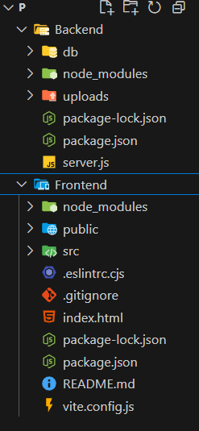

# 📚 BookNest - Where Stories Nestle

BookNest is a full-stack MERN (MongoDB, Express, React, Node.js) web application that provides users with a seamless online bookstore experience — from discovering books to purchasing and reviewing them.

---

## 🌟 Features

### 👤 User Module
- User Registration and Login (JWT-based authentication)
- Browse and filter books by genre, author, or price
- Add books to Wishlist or Cart
- Place orders securely
- View Order History & Track Orders

### 🛍️ Seller Module
- Seller registration & login
- Add new books with details (title, genre, author, price, cover image)
- View and manage listed products
- Handle incoming orders from users

### 🛠️ Admin Module
- Admin dashboard for managing users and sellers
- View all books and platform-wide orders

---

## 📁 Project Structure

